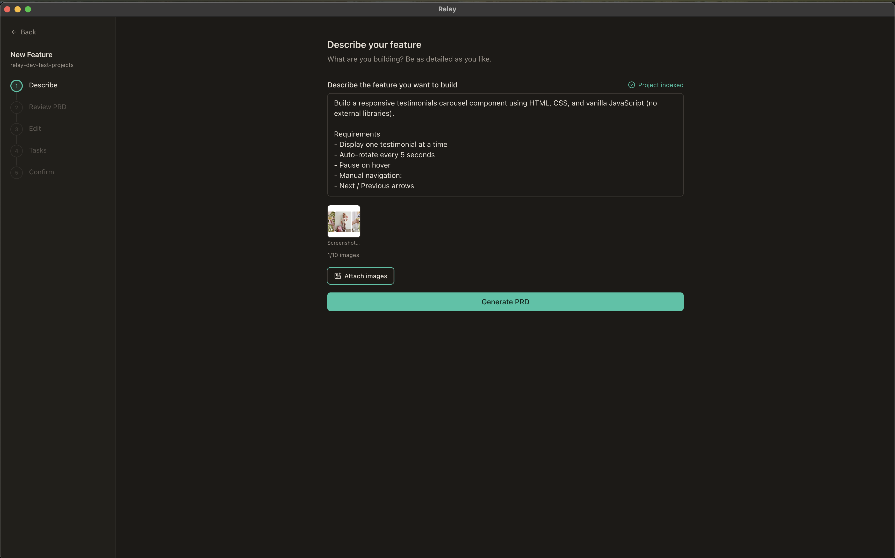
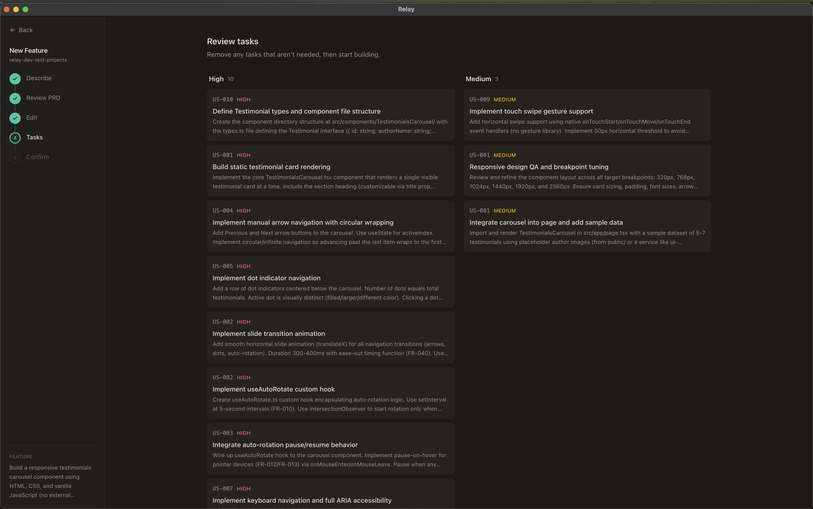
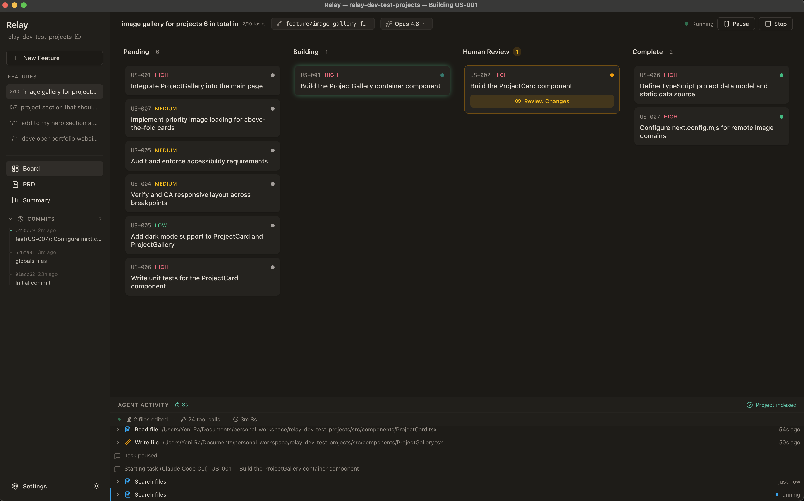
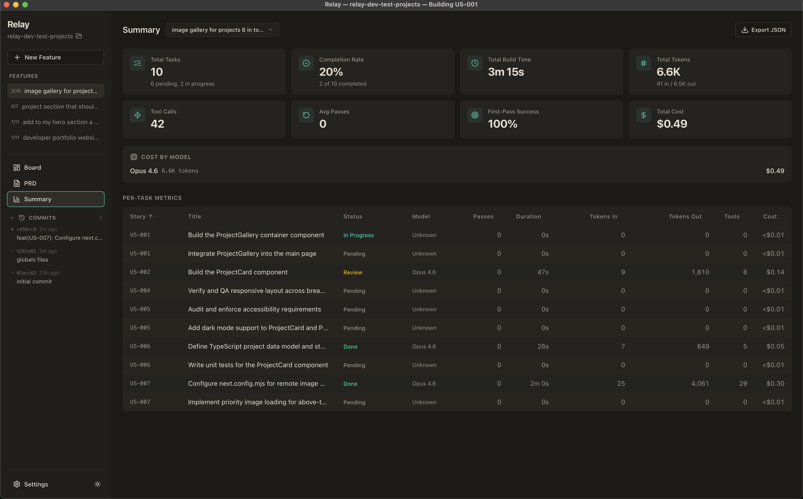

<p align="center">
  
</p>

<h1 align="center">Relay</h1>

<p align="center">
  Turn AI coding agents into a visual Kanban build loop.<br/>
  Describe a feature → AI generates a specification → decomposes into tasks → autonomous agent builds each task → you review via approve/reject gate.
</p>


<p align="center">
  
  
  
  
  
</p>

<p align="center">
  <a href="https://github.com/YoniRaviv/Relay/releases/latest/download/Relay-Mac-Installer.dmg"></a>
</p>

<p align="center">
  <video src="[https://github.com...](https://github.com/user-attachments/assets/ad634c2d-c016-4cb5-8ff8-5188a281df25)" width="800" height="800" controls></video>
</p>

> **macOS note:** If you see "app is damaged and should be moved to trash" after installing, run this in Terminal:
> ```bash
> xattr -cr /Applications/Relay.app
> ```
> This removes the macOS quarantine flag. The app is not signed with an Apple Developer certificate yet.

---

## What is Relay?

Relay is a desktop application that wraps AI coding agents into a structured, visual build workflow. Instead of manually prompting an AI and copy-pasting code, Relay automates the full cycle: planning, task decomposition, code generation, and review — all in a Kanban-style interface. Supports Claude Code and OpenAI Codex as execution engines.

## How It Works

1. **Setup** — Choose your engine (Claude Code CLI, OpenAI Codex CLI, or Anthropic API key) and open a project folder
2. **Describe a feature** — Write what you want built in plain English, attach screenshots, reference project files with `@filename`
3. **Review the specification** — The AI generates a feature specification document; edit and refine it
4. **Task decomposition** — The spec is broken into 3-10 structured tasks on a Kanban board
5. **Build loop** — Start the agent and watch it build each task, streaming progress in real time
6. **Review gate** — For each completed task, review the diff — approve to commit, or reject with notes to retry
7. **Run your project** — Click the Run button to preview your app with auto-detected run commands
8. **Create PR** — When all tasks complete, create a pull request directly from the app
9. **Track progress** — Cost, tokens, build time, and first-pass success rate in the Summary view

## Features

### Core Build Loop
- **Specification Wizard** — AI-generated feature specs with streaming preview, clarification questions, `@file` tagging, image paste support, and manual editing
- **Kanban Board** — Drag-and-drop task management across Pending, Building, Human Review, and Complete columns
- **Agent Loop** — Autonomous code generation with play/pause/stop controls and three build modes:
  - **Pause for Review** — Pauses after each task for human approve/reject
  - **Auto-Pilot** — Commits each task automatically and continues
  - **Continuous** — Builds all tasks without pausing; review at your own pace
- **Human Review Gate** — Syntax-highlighted diff viewer with file tree, approve/reject flow, and git integration
- **Smart Review Detection** — Tasks with no file changes are auto-approved and skip the review gate

### Multi-Engine Support
- **Claude Code CLI** (default) — Uses your existing Claude Code authentication via `@anthropic-ai/claude-agent-sdk`
- **OpenAI Codex CLI** — Uses your existing Codex authentication via `@openai/codex-sdk`
- **Anthropic API Key** — Direct SDK calls via `@anthropic-ai/sdk` with built-in file tools
- **Persistent Sessions** — Keep one Claude Code session alive across all tasks for 1M token context (reduces token waste)

### @ File Tagging
- Type `@` in any text field to reference project files
- Autocomplete dropdown with fuzzy search across git-tracked files
- Referenced file contents are injected into the AI prompt
- Available in feature descriptions, task descriptions, and acceptance criteria

### Project Runner
- **Auto-detection** — Detects run command from `package.json`, `Cargo.toml`, `pyproject.toml`, `go.mod`, `docker-compose.yml`, `Makefile`
- **Custom override** — Define your own command in `.relay/run.json`
- **Live output** — Streams stdout/stderr in a tabbed panel with clickable URLs
- **Play/Stop toggle** — In the board header, right next to model picker

### Git & Collaboration
- Automatic branch creation with search/filter for base branch
- `.gitignore` management (auto-adds framework-specific patterns)
- Commit on approve, push to remote, PR creation
- Feature rename, archive, and delete

### Quality of Life
- **Multi-Feature Support** — Multiple specs per project with independent task backlogs
- **Add Tasks Manually** — "+" button in Pending column or 3-priority-column layout in wizard
- **Feature Rename** — Inline edit in board header
- **Feature Archive** — Archive completed features to keep workspace focused
- **Build Timer** — Live elapsed timer while a task is being built
- **Persisted Summaries** — Task duration, actions, and files changed survive app restart (loaded from DB + git)
- **Metrics Dashboard** — Per-task and aggregate stats including cost tracking with per-model breakdown
- **Dark / Light Mode** — Toggle in sidebar, respects system preference
- **Keyboard Shortcuts** — `Space` to toggle the agent loop, `Esc` to close panels
- **Auto-Updates** — Built-in update checker for new releases
- **Per-Project SQLite** — All data stored locally in `.relay/relay.db` inside your project folder
- **Desktop Notifications** — Get notified when tasks need review or the build finishes

## Engine Modes

Relay supports three engine modes, selectable in Settings:

| Engine | Auth | Best For |
|--------|------|----------|
| **Claude Code CLI** (default) | Uses existing `claude login` auth | Claude Code / Max plan users |
| **OpenAI Codex CLI** | Uses existing `codex login` auth | Codex / ChatGPT Pro users |
| **Anthropic API Key** | Your `sk-ant-*` key | Pay-per-token usage |

## Tech Stack

| Layer | Technology |
|-------|-----------|
| Desktop shell | Electron 30 |
| Frontend | React 18, TypeScript, Tailwind CSS v4, shadcn/ui |
| State | Zustand |
| AI (Claude) | `@anthropic-ai/sdk`, `@anthropic-ai/claude-agent-sdk` |
| AI (Codex) | `@openai/codex-sdk` |
| Database | better-sqlite3 (per-project) |
| Git | simple-git |
| Build | Vite, electron-builder |

## Getting Started

### Prerequisites

- Node.js 18+
- npm
- One of: [Claude Code CLI](https://docs.anthropic.com/claude-code), [OpenAI Codex CLI](https://github.com/openai/codex), or an [Anthropic API key](https://console.anthropic.com/)

### Install

```bash
git clone https://github.com/YoniRaviv/Relay.git
cd Relay
npm install
```

### Development

```bash
npm run dev
```

Opens the app with Vite HMR. The Electron main process and preload script are compiled alongside the renderer.

#### Dev bypass (no API key needed)

In dev mode, enter **`dev-bypass`** as the API key to skip real API validation. You can also seed a demo project with sample data:

```bash
npx tsx scripts/seed-demo.ts
```

Then launch the app, enter `dev-bypass` as the key, and select the "Demo Project" to explore the UI with pre-populated tasks.

### Build

```bash
npm run build
```

Produces a packaged application in `release/` (`.dmg` on macOS, `.exe` on Windows, `.AppImage` on Linux).

### Lint

```bash
npm run lint
```

## Usage Guide

1. **Launch Relay** and choose your engine in the setup screen
2. **Create or open a project** — point to any folder on your machine
3. **Click "New Feature"** — describe what you want built, use `@filename` to reference code

<p align="center">
  
</p>

4. **Review the specification** — the AI generates a detailed spec; edit as needed, then approve

5. **Review tasks** — the spec is decomposed into ordered tasks grouped by priority

<p align="center">
  
</p>

6. **Select your model** and build mode, then click **Start**
7. **Watch the agent work** — each task streams activity in the feed below the board
8. **Approve or reject** — review diffs, commit approved work, reject with notes to retry

<p align="center">
  
</p>

9. **Run your project** — click the Run button to preview your app
10. **Create a PR** — when all tasks are done, use the green button to add a remote or create a PR
11. **Check the Summary** tab for cost and performance metrics

<p align="center">
  
</p>

## Project Structure

```
electron/
  main.ts              # Electron main process
  preload.ts           # Context bridge (relayAPI, ~90+ methods)
  agent/               # Agent runner, prompts, loop controller, engines
    engines/           # SDK engine, CLI engine, Codex engine
    openaiRunner.ts    # Codex text generation for PRD/clarify/decompose
  db/                  # SQLite connection and schema (8 migrations)
  git/                 # Git utilities (lock mutex, commit helper)
  runner/              # Project runner (auto-detect, spawn, stop)
  ipc/                 # IPC handlers (settings, project, prd, tasks, agent, git, review, runner, metrics)
shared/
  types.ts             # Shared TypeScript interfaces (EngineMode, SessionMode, etc.)
  pricing.ts           # Model pricing table (Anthropic + OpenAI, engine-tagged)
src/
  pages/               # Board, PRDWizard, Setup, Summary
  modules/             # Feature-based component modules
    board/             # KanbanBoard, TaskCard, TaskDetail, AddTaskButton, ArchiveView
    agent/             # LoopControls, AgentActivityFeed, RunProjectButton, RunOutputPanel
    review/            # ReviewPanel, DiffViewer, PrCreationDialog
    prd/               # PRDPreview, PRDEditor, FeatureInput, FileAutocomplete, StreamingProgress
    settings/          # SettingsView (3 engines), ModelPicker (engine-filtered)
    project/           # ProjectSelector, ProjectSidebar, GitHistoryPanel
    metrics/           # TaskMetricsTable, MetricCard
  shared/              # Reusable utilities, hooks, types, and components
  components/ui/       # shadcn/ui primitives
  store/               # Zustand store
  lib/                 # Utilities (theme, keyboard shortcuts)
```

## Keyboard Shortcuts

| Key | Action |
|-----|--------|
| `Space` | Play / Pause the agent loop |
| `Esc` | Close the active panel (review or task detail) |

## License

This project is licensed under the [GNU General Public License v3.0](LICENSE).
